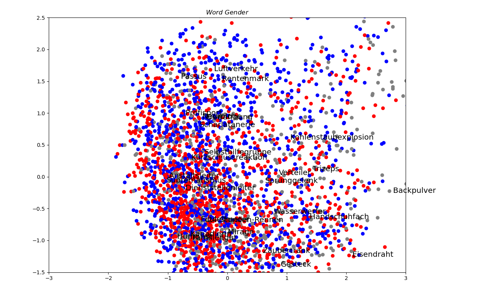
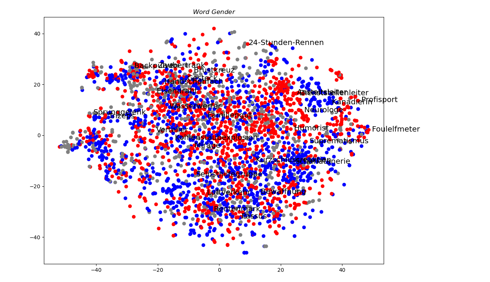

# word_gender

一个做着玩的demo。本仓库可视化了一些随机抽取的名词在语义空间中的分布和阴阳中性的关系。
已完成语言：德语。

### 结果展示

阳性-红色，中性-灰色，阴性-蓝色

#### 德语

图1. PCA降维至二维结果

图2. t-SNE降维至二维结果

图3. t-SNE降维至三维结果

在德语上随机抽取的这3k个词里，用[1]这种预训练的词向量时，似乎t-SNE降维比PCA降维得到的结果更有规律，能显现出少量的阳性和阴性语义团块。不过整体显示出阴阳中性没有很好的规律，分布比较均匀。

### 数据来源

[1] [GermanWordEmbeddings (devmount.github.io)](https://devmount.github.io/GermanWordEmbeddings/#download)

[2] german/gender/german_gender.txt 来源链接实在找不到了，待补充

### 方法

- 在数据降至二维的可视化上，没有做特殊的处理。
- 在数据降至三维的可视化上，因为降维后发现存在数个非常极端的数据点，导致大部分数据挤成一团难以看清，因此在可视化前做了（1）删除9个极端值和（2）归一化两个处理。

### 运行方法
#### 德语  `german/`目录
- 在[GermanWordEmbeddings (devmount.github.io)](https://devmount.github.io/GermanWordEmbeddings/#download)下载`german.model`这个文件，放在`german/vector/`目录。
- 找到`german/german_2d.py`和`german/german_3d.py`两个文件，可以直接运行。
- 也可以根据需要，修改代码里的`isPCA`和`data_percent`两个参数。`isPCA`表示是否使用PCA降维，否则使用t-SNE降维。`data_percent`表示可视化的数据百分比，因总共有30k条数据，`data_percent = 10`就表示可视化1/10的数据即3k条。注意`data_percent = 1`时，两个可视化脚本均要运行30min左右。
  
### 参考资料

- 后续可引用的数据
[NLPL word embeddings repository](http://vectors.nlpl.eu/repository/) 一个多种语言的预训练词向量工作（缺少使用方法文档）
[Ismailhachimi/French-Word-Embeddings: French word embeddings from series sub-titles (github.com)](https://github.com/Ismailhachimi/French-Word-Embeddings) 一个法语预训练词向量数据集
[https://github.com/SaraBee/Genderizer](https://github.com/SaraBee/Genderizer) 含德语和西语阴阳中性数据

- 其它类似的仓库
[https://github.com/aakhundov/deep-german](https://github.com/aakhundov/deep-german) 一个德语阴阳中性CNN分类器
[https://github.com/Pimverleg/German-gender-finder](https://github.com/Pimverleg/German-gender-finder) 一个提供德语阴阳中性的包
[https://github.com/fengxueem/German-Noun-Gender](https://github.com/fengxueem/German-Noun-Gender) 一个德语阴阳中性的练习工具
[https://github.com/Andrew-2609/german-gender-api](https://github.com/Andrew-2609/german-gender-api) 一个德语阴阳中性的API工具

### 后续改进和反馈
- 本demo受启发于一些初学法语和德语的朋友问我，词汇的阴阳性非常难记，你能不能告诉我有什么整体规律。我想起自己初学这两门语言的时候也有这种疑问，联想到词向量的语义空间这个概念，就考虑做下可视化。
- 德语的计算语言学整体比较发达，数据很好找，所以很快就完成了。可用的法语的预训练词向量和阴阳性数据则比较难找，因此搁置了。如果找到比较好的数据，我还会补充其它语言的可视化，看看有无规律。
- 也有考虑是否取一部分词汇的阴阳性规律会比较明显，比如各种学科的名称术语。有关这点欢迎建议。
- 如对本仓库有改进建议，或对于后续工作（添加实验、应用场景）有其它想法，可以提交在issue。
- 请随意使用本仓库的代码，注明仓库链接即可。
